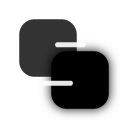

<div align="center">
  
  
  # Send2Me
  
  **Secure, Blazing-Fast, Peer-to-Peer File Transfer & Synchronization Desktop Application.**
  
  [](https://opensource.org/licenses/MIT)
  [](https://tauri.app/)
  [](https://www.rust-lang.org/)
  [](https://reactjs.org/)
  [](https://github.com/pmndrs/zustand)
</div>

<br/>

Send2Me is a next-generation desktop application designed to make local network and peer-to-peer file sharing effortless and strictly private. Built with a deeply optimized Rust backend and a beautiful React frontend, Send2Me operates entirely peer-to-peer without relying on centralized servers or third-party cloud providers.

---

## 📑 Table of Contents
- [The Origin Story](#-the-origin-story)
- [The Problem Statement](#-the-problem-statement)
- [Key Features](#-key-features)
- [Architecture & Tech Stack](#-architecture)
- [Getting Started (Development)](#-getting-started-development)
- [Building for Production](#-building-for-production)
- [License](#-license)

---

## 📖 The Origin Story

Send2Me was born out of frustration with modern file-sharing limitations. While developing across multiple devices, we realized that sending a 50GB video file from a laptop to a desktop sitting just two feet away required either an external hard drive, a slow Bluetooth connection, or uploading the entire file to a cloud provider just to download it again.

We set out to build an application that utilizes the maximum bandwidth of your local network, seamlessly traverses strict firewalls using NAT-punching, and wraps it all in an incredibly beautiful, premium user interface. The result is **Send2Me** — an uncompromising blend of Rust's raw performance and React's gorgeous UI capabilities.

## ❗ The Problem Statement

**1. The Cloud Bottleneck:** Traditional file sharing relies on uploading to a central server (like Google Drive or Dropbox). This is inherently slow, bandwidth-intensive, and limits you based on subscription tiers.
**2. Privacy & Security:** Once your data is on someone else's server, you lose control over it.
**3. The Local Network Paradox:** Most people have Gigabit WiFi routers, yet they still email files to themselves. Local transfer apps are often ugly, unreliable, or require complex IP address configurations.

**The Solution:** Send2Me connects devices directly. It uses cutting-edge `Iroh` networking to negotiate the fastest possible route (Local LAN, WiFi Direct, or NAT-traversed WAN), fully encrypts the connection, and transfers data byte-for-byte at native disk speeds.

---

## ✨ Key Features

### 🚀 Direct, Blazing-Fast File Transfers
Send massive files instantly across the room or the world with zero bottlenecks. Send2Me uses chunked byte-streaming to ensure zero memory bloat, allowing you to send 100GB+ files effortlessly.

### 🔒 Uncompromising End-to-End Encryption
All data in transit is fully encrypted and secured using Noise protocols. The application operates purely peer-to-peer. Nobody—not even your ISP—can intercept or read your files.

### 📂 Strict Folder Synchronization (P2P Sync)
Bind two devices together and keep a designated folder in absolute, strict parity.
- **Real-Time Mirroring:** Changes are reflected instantly.
- **Zero Waste:** No hidden trash folders; deleted files are permanently deleted.
- **Self-Healing:** If a connection drops, the sync automatically resumes and heals the queue upon reconnection.

### 🎨 Premium, Dynamic User Interface
A stunning, modern user interface built with Tailwind CSS and Framer Motion. 
- Features micro-animations that react to your actions.
- A dynamic **Active Transfers** UI that visually streams progress in real-time.
- Sleek dark-mode optimized aesthetics that feel natively integrated into your OS.

### 🌐 Absolutely No Cloud Limits
Your files never touch a cloud server. Transfer sizes are limited only by your hard drive space. No subscriptions, no data caps, no central authority.

*(For a comprehensive dive into all capabilities, please see the [Features Documentation](docs/Features.md))*

---

## 🏗️ Architecture

Send2Me leverages a highly performant and modern technology stack:

- **Frontend:** [React 18](https://reactjs.org/) + [TypeScript](https://www.typescriptlang.org/) + [Tailwind CSS](https://tailwindcss.com/) + [Framer Motion](https://www.framer.com/motion/)
- **State Management:** [Zustand](https://github.com/pmndrs/zustand)
- **Backend Core:** [Rust](https://www.rust-lang.org/)
- **Desktop Framework:** [Tauri v2](https://tauri.app/)
- **Networking Core:** [Iroh](https://iroh.computer/) (NAT-traversing, high-speed P2P)

*(For a detailed breakdown of how the Tauri Bridge and P2P networking operate, see the [Architecture Documentation](docs/Architecture.md))*

---

## 🛠️ Getting Started (Development)

### Prerequisites
- [Node.js](https://nodejs.org/) (v18+)
- [Rust](https://www.rust-lang.org/tools/install)
- Relevant C++ Build Tools depending on your OS (See [Tauri Prerequisites](https://v2.tauri.app/start/prerequisites/))

### Installation

1. Clone the repository:
   ```bash
   git clone https://github.com/yourusername/send2me.git
   cd send2me
   ```

2. Install frontend dependencies:
   ```bash
   npm install
   cd apps/desktop
   npm install
   ```

3. Start the development server:
   ```bash
   npm run tauri dev
   ```
   *This command will compile the Rust backend and launch the React frontend with hot-module reloading.*

*(For extensive setup instructions and troubleshooting, see the [Getting Started Guide](docs/GettingStarted.md))*

---

## 📦 Building for Production

To build an optimized, release-ready executable for your OS:

```bash
cd apps/desktop
npm run tauri build
```
The compiled binaries will be located in `apps/desktop/src-tauri/target/release/bundle/`.

---

## 📄 License

This project is licensed under the MIT License. See the [LICENSE](LICENSE) file for details.

---
<div align="center">
  <i>Crafted with passion for secure and open-source data ownership.</i>
</div>
