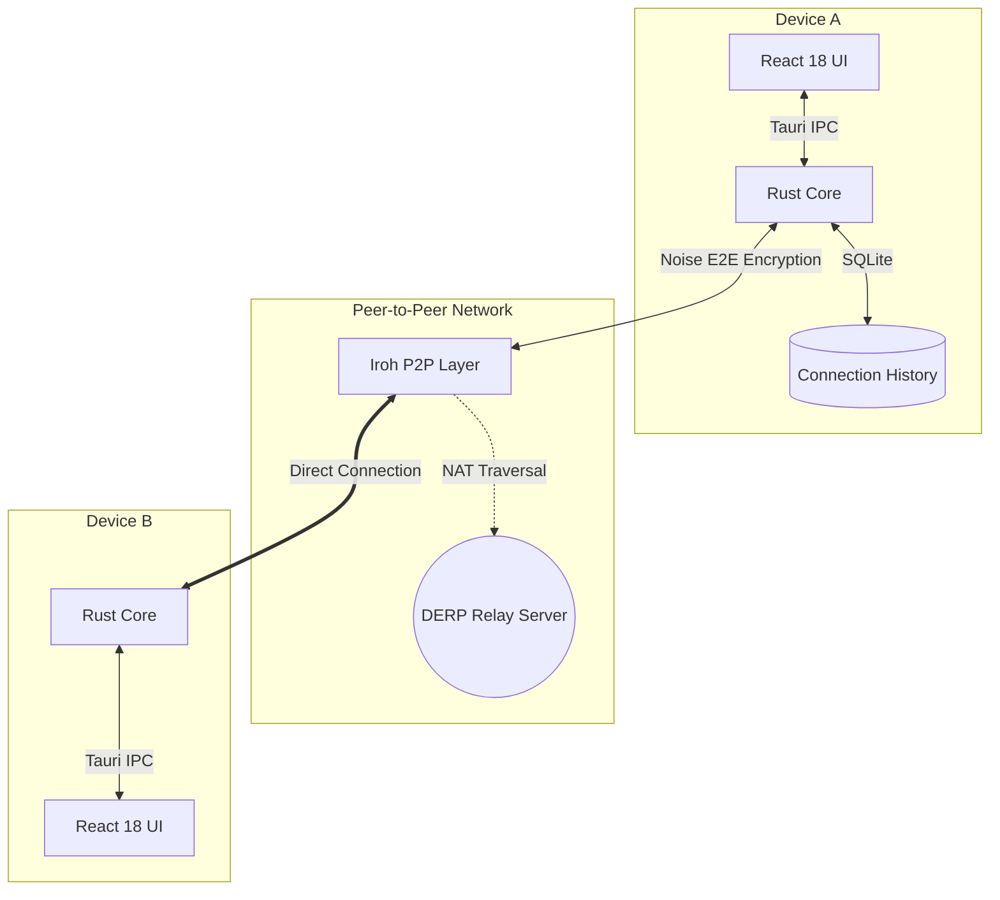

<div align="center">
  

  # Send2Me

  **Fast, 100% Private, Direct File Transfer & Sync Between Devices — Zero Cloud Required.**

  [](https://github.com/AspiringWebGaurav/send2me-rust-app/releases/latest)
  [](LICENSE)
  [](https://tauri.app/)
  [](https://github.com/AspiringWebGaurav/send2me-rust-app/actions)

  <br/>

  <a href="https://github.com/AspiringWebGaurav/send2me-rust-app/releases/latest">
    
  </a>
</div>

<br/>

---

## ⚡ How It Works (3 Easy Steps)

| 1️⃣ Download | 2️⃣ Install | 3️⃣ Start Sharing |
| :---: | :---: | :---: |
| Click the download link for your computer below | Double-click the downloaded file to run setup | Pick files and send them directly to any device! |

---

## 💻 Choose Your Computer & Download

### 🪟 Windows (10 / 11)
- 👉 **[Send2Me Setup Installer (.exe)](https://github.com/AspiringWebGaurav/send2me-rust-app/releases/latest)** — **⭐ RECOMMENDED** *(Standard setup wizard with start menu shortcuts)*

<details>
<summary>🛠️ Advanced Windows Options (MSI, Portable)</summary>

- **Enterprise MSI Installer:** `Send2Me_x64.msi` *(For corporate IT deployment)*
- **Portable Executable (No Install Needed):** `Send2Me_x64-portable.exe`
- **Portable ZIP Archive:** `Send2Me_windows-x64.zip`
</details>

---

### 🍎 Mac (macOS)
- 🍏 **[Apple Silicon DMG (M1 / M2 / M3 / M4)](https://github.com/AspiringWebGaurav/send2me-rust-app/releases/latest)** — *Drag to Applications folder*
- 💻 **[Intel Mac DMG](https://github.com/AspiringWebGaurav/send2me-rust-app/releases/latest)** — *For older Intel-based Macs*

---

### 🐧 Linux (Ubuntu, Debian, Fedora, Arch)
- 🚀 **[Universal AppImage](https://github.com/AspiringWebGaurav/send2me-rust-app/releases/latest)** — *Double-click to run on any Linux distro*
- 📦 **[Debian / Ubuntu Package (.deb)](https://github.com/AspiringWebGaurav/send2me-rust-app/releases/latest)** — *Native Linux installer package*

---

## ✨ Why Choose Send2Me?

- 🚀 **Unlimited Speed:** Transfers files at your local Wi-Fi router's max speed (100MB/s+).
- 🔒 **100% Private & Encrypted:** Data transfers directly from device A to device B — never touches any cloud server.
- 📂 **Automatic Folder Sync:** Keep a designated folder synchronized across two computers automatically.
- 🎯 **No Account Required:** Zero sign-up, no monthly subscriptions, and no file size limits.

---

<details>
<summary><b>🛠️ Developer & Enterprise Technical Documentation (Click to Expand)</b></summary>

<br/>

### 📖 The Origin & Architecture

Send2Me is built using a deeply optimized **Rust** backend and a **React 18** frontend powered by **Tauri v2**. Network traversal is managed via **Iroh** P2P with Noise end-to-end encryption.


```mermaid
graph TD
    subgraph Device A
        ReactA[React 18 UI] <-->|Tauri IPC| RustA[Rust Core]
        RustA <-->|SQLite| LocalDB[(Connection History)]
    end

    subgraph Peer-to-Peer Network
        Iroh[Iroh P2P Layer]
        Relay((DERP Relay Server))
    end

    subgraph Device B
        RustB[Rust Core] <-->|Tauri IPC| ReactB[React 18 UI]
    end

    RustA <-->|Noise E2E Encryption| Iroh
    Iroh -.->|NAT Traversal| Relay
    Iroh <==>|Direct Connection| RustB
```

### 🛡️ Enterprise Security & Vulnerability Audits
- [Enterprise Security Policy & Vulnerability Disclosure](SECURITY.md)
- [STRIDE Threat Model Assessment](docs/ThreatModel.md)

### 🔒 Cryptographic Verification
To verify the SHA-256 integrity of release packages:
- **Windows PowerShell:** `Get-FileHash -Algorithm SHA256 .\Send2Me_x64-setup.exe`
- **Linux / macOS:** `sha256sum Send2Me_Linux-x86_64.AppImage`

### 💻 Local Development Setup

```bash
# Clone the repository
git clone https://github.com/AspiringWebGaurav/send2me-rust-app.git
cd send2me-rust-app

# Install frontend dependencies
cd apps/desktop
npm install

# Run application in desktop development mode
npm run tauri dev
```

### 📦 Production Build
```bash
cd apps/desktop
npm run tauri build
```
Binaries will be generated in `apps/desktop/src-tauri/target/release/bundle/`.

</details>

---

<div align="center">
  <i>Licensed under MIT. Open Source, Private, & Local Data Ownership.</i>
</div>

